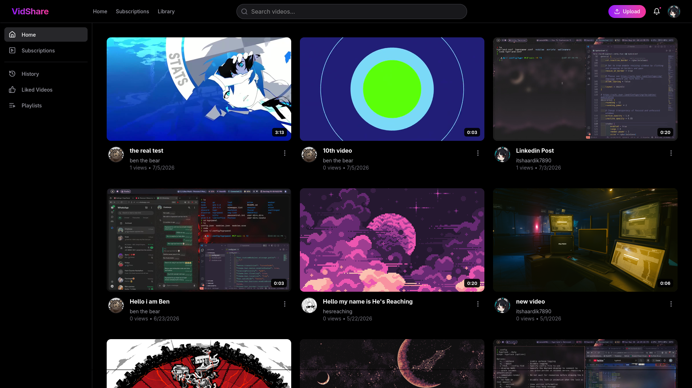
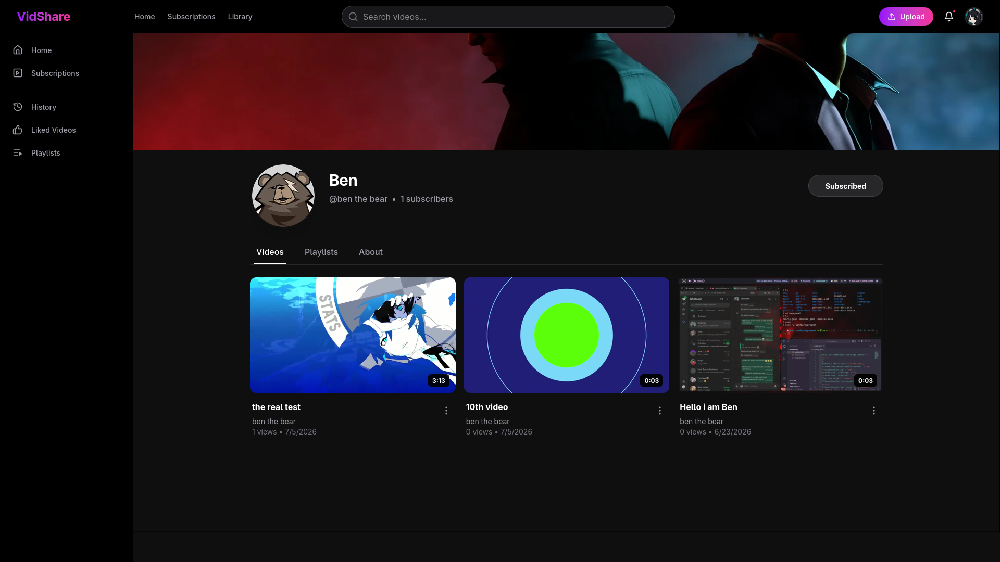
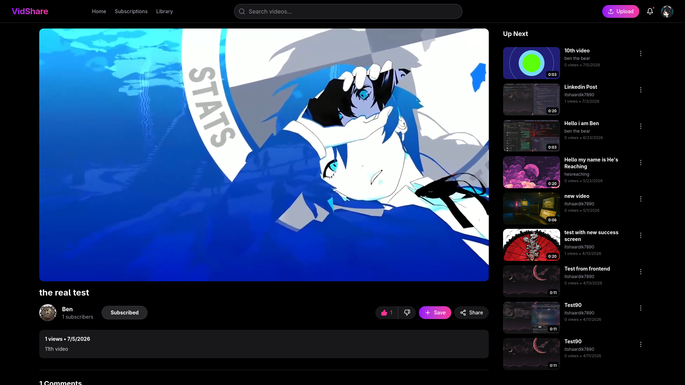
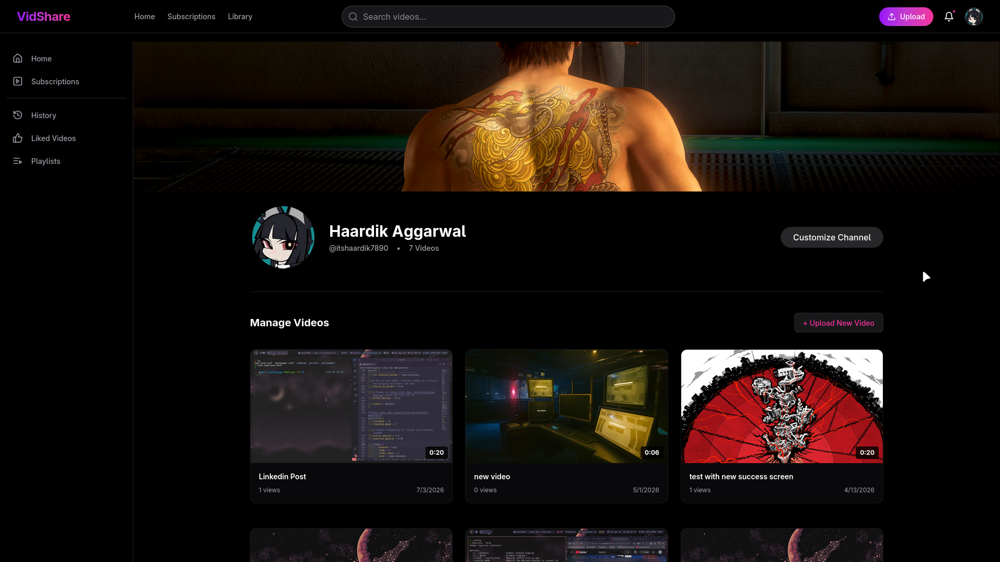
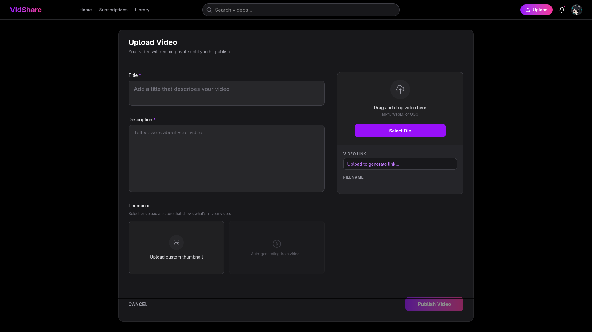

<div align="center">

# 🎥 VideoHub

### A modern full-stack video streaming platform built with the MERN stack.

Upload videos, build channels, subscribe to creators, create playlists, track watch history, and interact through likes and comments—all powered by a scalable Express backend and MongoDB.

<!-- TODO: Add a hero screenshot or GIF -->



[🌐 Live Demo](https://vidshare.haardik.co.in) • [📚 API Docs](https://mintlify.wiki/barcode8/VideoHub/api/overview)

</div>

---

# 📖 About

VideoHub is a YouTube-inspired video streaming platform built to explore what goes into a real-world media application beyond basic CRUD operations.

The project focuses on designing a scalable backend architecture while implementing features commonly found in production streaming platforms, including secure authentication, media uploads, playlists, subscriptions, analytics, and watch history.

Rather than simply storing videos, VideoHub demonstrates how authentication, cloud storage, database relationships, and RESTful APIs work together in a complete application.

---

# ✨ Preview

<table>
<tr>
<td>

### User Profile

<!-- TODO -->


</td>

<td>

### Video Player

<!-- TODO -->


</td>
</tr>

<tr>
<td>

### Channel Dashboard

<!-- TODO -->


</td>

<td>

### Upload Flow

<!-- TODO -->


</td>
</tr>
</table>

---

# 🚀 Features

## Authentication

- Secure JWT Authentication
- Access & Refresh Token implementation
- Cookie-based sessions
- Password hashing with bcrypt
- Protected routes using middleware

---

## Video Platform

- Upload videos
- Thumbnail uploads
- Publish / Unpublish videos
- View counting
- Watch history
- Video metadata editing
- Delete videos

---

## Social Features

- Like videos
- Like comments
- Comment system
- User subscriptions
- Channel profiles
- Playlist management

---

## Dashboard

- Channel statistics
- Total views
- Subscriber analytics
- Video management

---

# 🏗️ Technical Highlights

Unlike a basic CRUD application, VideoHub includes several production-inspired backend concepts.

- Modular Express architecture
- JWT authentication with refresh token rotation
- Cloudinary media storage
- Multer upload pipeline
- MongoDB Aggregation Pipelines
- Cookie-based authentication
- Centralized error handling
- Custom API response wrappers
- Docker support
- Environment-based configuration

---

# 🏛️ Architecture

```text
                    React + Vite
                          │
                     Axios Requests
                          │
────────────────────────────────────────────────────
                    Express REST API
────────────────────────────────────────────────────
                          │
                Authentication Middleware
                          │
      ┌──────────────┬──────────────┬──────────────┐
      │              │              │
    Users         Videos        Social APIs
      │              │              │
      └──────────────┴──────────────┘
                     Business Logic
                          │
                   Mongoose Models
                          │
                      MongoDB Atlas
                          │
          Cloudinary ← Upload Pipeline
```

---

# 🧠 Database Design

```text
User
 ├── uploads
 ├── playlists
 ├── subscriptions
 ├── likes
 └── watchHistory

Video
 ├── owner
 ├── thumbnail
 ├── videoFile
 ├── views
 └── isPublished

Playlist
 └── videos[]

Comment
 └── video

Subscription
 ├── subscriber
 └── channel

Like
 ├── video
 └── comment
```

---

# 📂 Project Structure

```text
VideoHub
│
├── Frontend
│   ├── src
│   ├── components
│   ├── pages
│   ├── hooks
│   └── assets
│
└── Backend
    ├── controllers
    ├── routes
    ├── middlewares
    ├── models
    ├── db
    ├── utils
    └── app.js
```

---

# ⚙️ Getting Started

## Clone the repository

```bash
git clone https://github.com/yourusername/videohub.git

cd VideoHub
```

---

## Backend

```bash
cd Backend

npm install

npm run dev
```

---

## Frontend

```bash
cd Frontend

npm install

npm run dev
```

---

# 🔑 Environment Variables

Create a `.env` file inside the Backend folder.

```env
PORT=

MONGODB_URI=

ACCESS_TOKEN_SECRET=

ACCESS_TOKEN_EXPIRY=

REFRESH_TOKEN_SECRET=

REFRESH_TOKEN_EXPIRY=

CLOUDINARY_CLOUD_NAME=

CLOUDINARY_API_KEY=

CLOUDINARY_API_SECRET=
```

---

# 📡 API Overview

| Module | Description |
|----------|-------------|
| Authentication | User login & registration |
| Users | Profile management |
| Videos | Upload, publish & manage videos |
| Comments | Video discussions |
| Likes | Video & comment likes |
| Playlists | Playlist management |
| Subscriptions | Channel subscriptions |
| Dashboard | Creator analytics |
| Views | View tracking |

> **TODO:** Add Swagger / Postman collection here.

---

# 💡 Engineering Decisions

Some notable implementation decisions made during development:

- Media files are stored on Cloudinary instead of the application server.
- Authentication uses JWT access and refresh tokens for better security.
- Business logic is isolated inside controllers to keep routes lightweight.
- MongoDB ObjectId references are used to model relationships between users, videos, comments, playlists, and subscriptions.
- Middleware is used extensively to handle authentication, uploads, and request validation.

---

# 🚧 Potential Future Work

- Adaptive bitrate streaming (HLS)
- Video transcoding queue
- Redis caching
- Notification system
- Email verification
- Live streaming
- Recommendation engine
- Unit & Integration tests
- CI/CD pipeline
- Kubernetes deployment

---

# 📸 Demo

<!-- TODO -->

### Upload Flow

Add a GIF showing the upload process.

---

### Authentication

Add a GIF demonstrating login.

---

### Playlist Management

Add a GIF.

---

### Dashboard

Add screenshots.

---

<div align="center">

Built with ❤️ using React, Express, MongoDB, and Cloudinary.

</div>